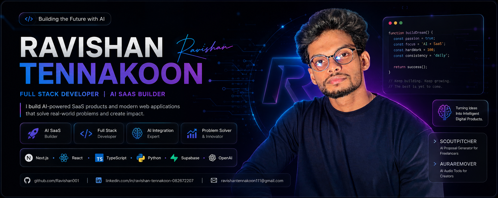

<p align="center">
  
</p>

<div align="center">

# Hi, I'm Ravishan Tennakoon 👋

### Full Stack Developer • AI SaaS Builder • Future AI Engineer


<br/>

<p>
  <a href="mailto:ravishantennakoon111@gmail.com">
    
  </a>

  <a href="https://www.linkedin.com/in/ravishan-tennakoon-082672207/">
    
  </a>

  <a href="https://github.com/Ravishan001">
    
  </a>
</p>


</div>

---

## 👨‍💻 About Me

I'm a Full Stack Developer and AI SaaS builder focused on creating intelligent, modern, and user-friendly digital products.

I enjoy transforming ideas into real-world applications by combining clean user interfaces, scalable backend systems, AI integrations, and thoughtful product design.

* 🚀 Founder and builder of **ScoutPitcher**
* 🎵 Creator of **AuraRemover**
* 💼 Working as a **Freelance Developer**
* 🎓 Studying **BEng Software Engineering** at the **Informatics Institute of Technology**
* 🤖 Interested in AI engineering, SaaS development, and intelligent automation
* 🎨 Passionate about UI/UX design and modern responsive interfaces
* 🌍 Based in **Kuliyapitiya, Sri Lanka**
* 💡 Building products designed for users around the world

---

## ⚡ Professional Identity

```text
Role          Full Stack Developer
Focus         AI-Powered SaaS Products
Current Work  ScoutPitcher and AuraRemover
Education     BEng Software Engineering
Location      Kuliyapitiya, Sri Lanka
Goal          AI Engineer • Startup Founder • SaaS Entrepreneur
```

---

## 🎯 Current Focus

* Building and launching **ScoutPitcher**
* Developing AI-powered features using the **OpenAI API**
* Improving full-stack architecture and backend scalability
* Creating responsive, modern, and accessible user interfaces
* Learning more about AI engineering and intelligent automation
* Turning practical ideas into real SaaS products

---

## 💬 My Mission

> Building AI-powered SaaS products that combine intelligent technology, scalable engineering, and exceptional user experiences to solve real-world problems.

---

## 📫 Connect With Me

<div align="center">

<a href="mailto:ravishantennakoon111@gmail.com">
  
</a>

<a href="https://www.linkedin.com/in/ravishan-tennakoon-082672207/">
  
</a>

<a href="https://github.com/Ravishan001">
  
</a>

</div>

---

## 🛠️ Tech Stack

<div align="center">

### Frontend Development


<br/><br/>

### Backend Development


<br/><br/>

### Programming Languages


<br/><br/>

### Databases


<br/><br/>

### Cloud and Deployment


<br/><br/>

### Development and Design Tools


</div>

---

## 💻 Programming Languages

| Language   | Usage                                                                   |
| ---------- | ----------------------------------------------------------------------- |
| JavaScript | Frontend development, interactive web applications, and API integration |
| TypeScript | Type-safe React and Next.js application development                     |
| Python     | AI integrations, backend services, automation, and data processing      |
| Java       | Object-oriented programming and software engineering projects           |
| C#         | Application development and object-oriented programming                 |
| PHP        | Backend web development and server-side applications                    |

---

## ⚙️ Frameworks and Libraries

<p align="left">


</p>

---

## 🗄️ Databases

<p align="left">


</p>

* Designing relational database structures
* Building secure authentication systems
* Working with Supabase Row Level Security
* Creating database-driven SaaS applications
* Managing user profiles, subscriptions, credits, and application data
* Integrating frontend applications with cloud databases

---

## ☁️ Cloud and Deployment Platforms

<p align="left">


</p>

* Deploying modern web applications
* Managing environment variables and production configurations
* Hosting frontend and backend services
* Connecting cloud databases and APIs
* Working with serverless and cloud-based application architectures

---

## 🤖 AI and SaaS Development

<p align="left">


</p>

* OpenAI API integration
* Prompt engineering
* AI-powered content generation
* AI proposal generation and improvement
* AI audio processing
* Intelligent workflow automation
* Credit-based SaaS systems
* Authentication and authorization
* Subscription-focused product architecture
* Responsive SaaS dashboard development
* User-focused AI product design

---

## 🎨 UI/UX and Product Design

* Responsive interface design
* Dark and light mode systems
* Modern dashboard design
* Mobile-first layouts
* User onboarding flows
* Product-focused user experiences
* Clean and accessible interfaces
* SaaS pricing and upgrade experiences
* Design systems and reusable components

---

## 🧩 Core Strengths

```text
Frontend        Next.js • React • TypeScript • Tailwind CSS
Backend         Node.js • Python • Flask
Databases       PostgreSQL • Supabase • MySQL • MongoDB
AI              OpenAI API • Prompt Engineering • Automation
Cloud           Vercel • Netlify • Railway • AWS • Azure
Design          UI/UX • Responsive Design • Figma
Product         SaaS Architecture • Authentication • Credit Systems
```

---

## 🚀 Featured Projects

<table>
<tr>
<td width="50%" valign="top">

### 🎯 ScoutPitcher

**AI-powered SaaS platform for freelancers**

ScoutPitcher helps freelancers discover opportunities and generate personalized proposals using AI, making client outreach faster and more effective.

#### Highlights

* 🤖 AI proposal generation
* ✨ Proposal improvement
* 👤 User authentication
* 📊 Modern dashboard
* 🌙 Dark & Light mode
* 💳 Credit-based usage system
* ⚡ Built for scalability

**Tech Stack**

`Next.js` `React` `TypeScript` `Tailwind CSS` `Supabase` `PostgreSQL` `OpenAI API`

</td>

<td width="50%" valign="top">

### 🎵 AuraRemover

**AI Media Processing Platform**

AuraRemover is a web application focused on AI-powered media tools for creators, including audio processing and transcription features.

#### Highlights

* 🎧 Audio processing tools
* 🎙️ Audio transcription
* ⚡ Fast web interface
* 📱 Responsive design
* 🤖 AI-powered workflows

**Tech Stack**

`Python` `Flask` `JavaScript` `HTML` `CSS`

</td>
</tr>
</table>

---

## 🎯 Career Goals

* 🤖 Become an AI Engineer
* 💻 Build world-class Full Stack applications
* 🚀 Launch successful SaaS products
* 🌍 Create software used by people worldwide
* 📈 Build scalable AI businesses
* 💡 Solve real-world problems through technology

---

## 🎓 Education

### Bachelor of Engineering (BEng) in Software Engineering

**Informatics Institute of Technology (IIT)**

Focused on software engineering principles, web technologies, databases, algorithms, and modern application development.

---

## 💼 Current Roles

* 💻 Freelance Full Stack Developer
* 🚀 Building **ScoutPitcher**
* 🎵 Developing **AuraRemover**
* 🤖 AI SaaS Product Builder

---

## 🌱 Currently Learning

* Advanced Next.js
* AI Engineering
* SaaS Architecture
* System Design
* Cloud Deployment
* Backend Scalability
* Workflow Automation
* Modern Product Development

---

## ❤️ Interests

* 🎨 UI / UX Design
* 🤖 Artificial Intelligence
* 🚗 Cars
* 📷 Photography
* 🎮 Gaming
* 🚀 Startups
* 💼 Entrepreneurship

---

## 📌 Development Philosophy

> **"Great software is built by understanding people first, then solving their problems with technology."**

I enjoy creating products that are simple to use, visually polished, and powered by modern technologies. My focus is not just writing code—it's building software that delivers real value to users.

---

## 🚀 Current Mission

```text
✔ Building AI-powered SaaS products
✔ Continuously improving full-stack development skills
✔ Exploring modern AI technologies
✔ Creating scalable web applications
✔ Learning every day and shipping consistently
```

---

## 🚀 Featured Projects

<table>
<tr>
<td width="50%" valign="top">

### 🎯 ScoutPitcher

**AI-powered SaaS platform for freelancers**

ScoutPitcher helps freelancers discover opportunities and generate personalized proposals using AI, making client outreach faster and more effective.

#### Highlights

* 🤖 AI proposal generation
* ✨ Proposal improvement
* 👤 User authentication
* 📊 Modern dashboard
* 🌙 Dark & Light mode
* 💳 Credit-based usage system
* ⚡ Built for scalability

**Tech Stack**

`Next.js` `React` `TypeScript` `Tailwind CSS` `Supabase` `PostgreSQL` `OpenAI API`

</td>

<td width="50%" valign="top">

### 🎵 AuraRemover

**AI Media Processing Platform**

AuraRemover is a web application focused on AI-powered media tools for creators, including audio processing and transcription features.

#### Highlights

* 🎧 Audio processing tools
* 🎙️ Audio transcription
* ⚡ Fast web interface
* 📱 Responsive design
* 🤖 AI-powered workflows

**Tech Stack**

`Python` `Flask` `JavaScript` `HTML` `CSS`

</td>
</tr>
</table>

---

## 🎯 Career Goals

* 🤖 Become an AI Engineer
* 💻 Build world-class Full Stack applications
* 🚀 Launch successful SaaS products
* 🌍 Create software used by people worldwide
* 📈 Build scalable AI businesses
* 💡 Solve real-world problems through technology

---

## 🎓 Education

### Bachelor of Engineering (BEng) in Software Engineering

**Informatics Institute of Technology (IIT)**

Focused on software engineering principles, web technologies, databases, algorithms, and modern application development.

---

## 💼 Current Roles

* 💻 Freelance Full Stack Developer
* 🚀 Building **ScoutPitcher**
* 🎵 Developing **AuraRemover**
* 🤖 AI SaaS Product Builder

---

## 🌱 Currently Learning

* Advanced Next.js
* AI Engineering
* SaaS Architecture
* System Design
* Cloud Deployment
* Backend Scalability
* Workflow Automation
* Modern Product Development

---

## ❤️ Interests

* 🎨 UI / UX Design
* 🤖 Artificial Intelligence
* 🚗 Cars
* 📷 Photography
* 🎮 Gaming
* 🚀 Startups
* 💼 Entrepreneurship

---

## 📌 Development Philosophy

> **"Great software is built by understanding people first, then solving their problems with technology."**

I enjoy creating products that are simple to use, visually polished, and powered by modern technologies. My focus is not just writing code—it's building software that delivers real value to users.

---

## 🚀 Current Mission

```text
✔ Building AI-powered SaaS products
✔ Continuously improving full-stack development skills
✔ Exploring modern AI technologies
✔ Creating scalable web applications
✔ Learning every day and shipping consistently
```

---

## 🐍 Contribution Snake

<div align="center">


</div>

---

## 💼 Open to Opportunities

I'm open to collaborating on innovative full-stack, AI, and SaaS projects.

- Full Stack Web Development
- AI API Integration
- SaaS Product Development
- Frontend and UI/UX Development
- Freelance Development
- Startup Collaborations

---

## 📬 Contact

<div align="center">

<a href="mailto:ravishantennakoon111@gmail.com">
  
</a>

<a href="https://www.linkedin.com/in/ravishan-tennakoon-082672207/">
  
</a>

<a href="https://github.com/Ravishan001">
  
</a>

</div>

---

<div align="center">

### Building intelligent products that solve real-world problems.

<br/>


<br/><br/>

⭐ From [Ravishan Tennakoon](https://github.com/Ravishan001)

</div>
